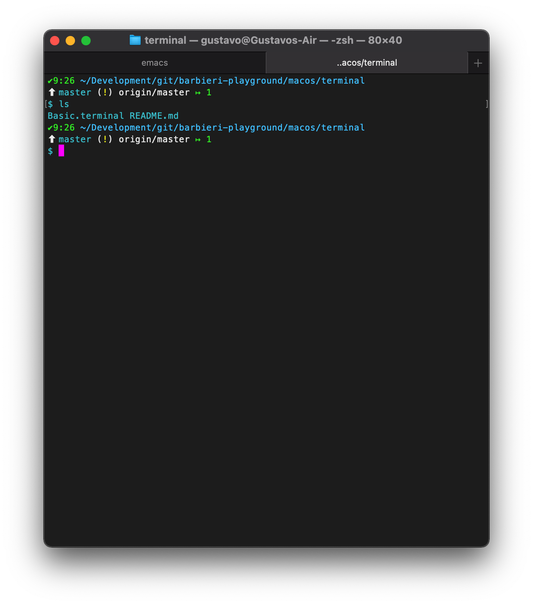

# MacOS Terminal.app Profile

To be used with [Meslo LG M Regular for
Powerline](https://github.com/powerline/fonts/blob/master/Meslo%20Slashed/Meslo%20LG%20M%20Regular%20for%20Powerline.ttf)

The screenshot uses my
[k-s.zsh-theme](https://github.com/barbieri/barbieri-playground/blob/master/zsh/theme/k-s.zsh-theme)

